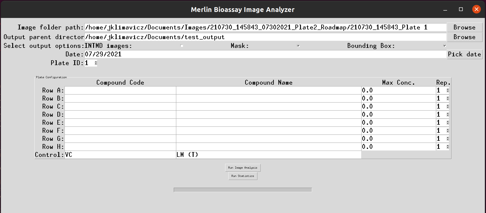
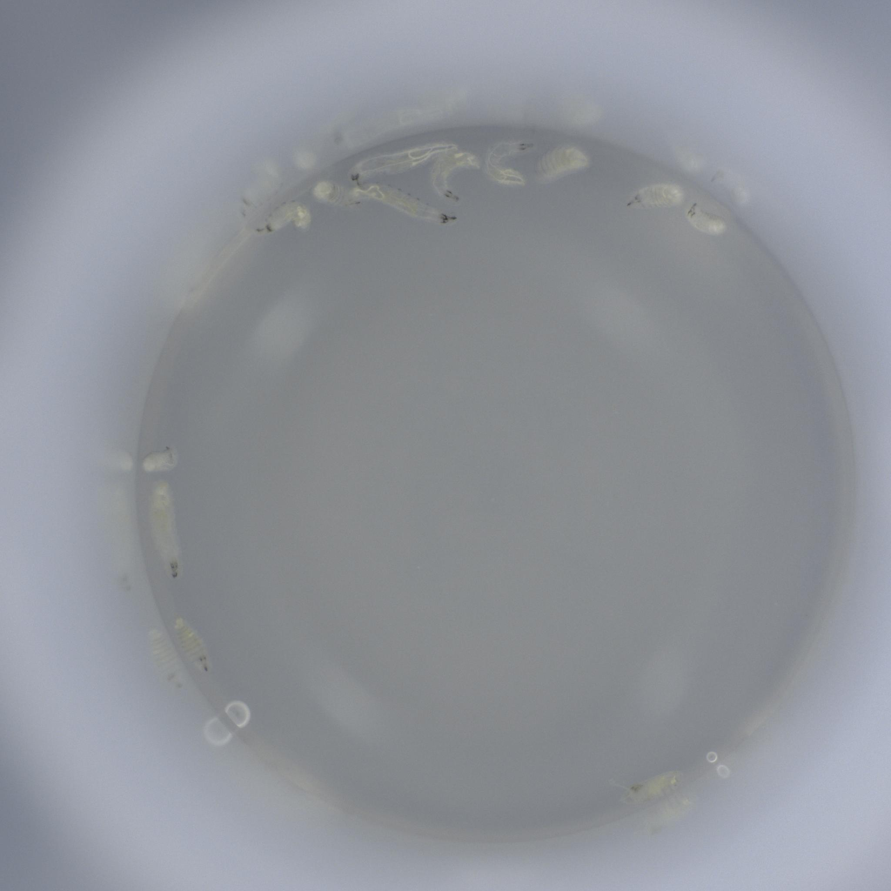
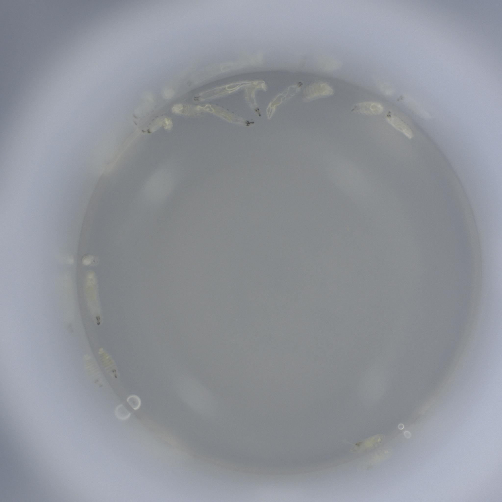
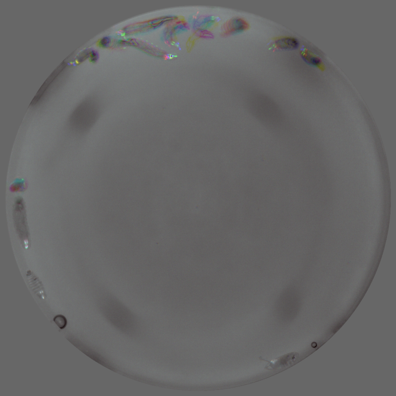
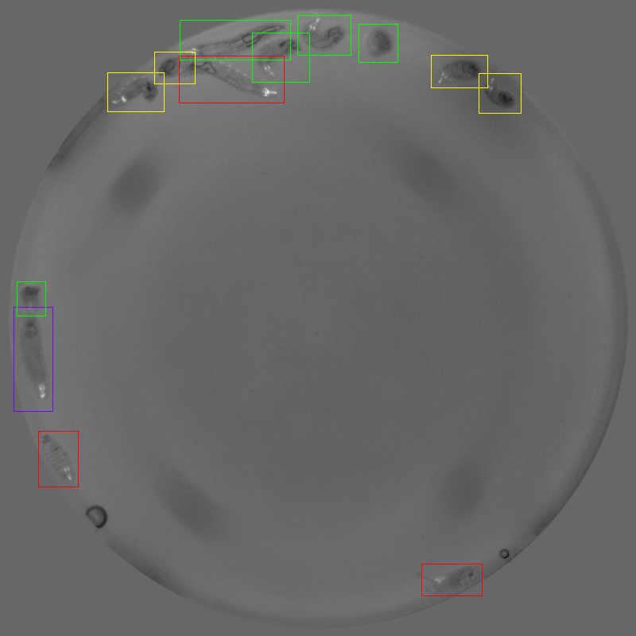
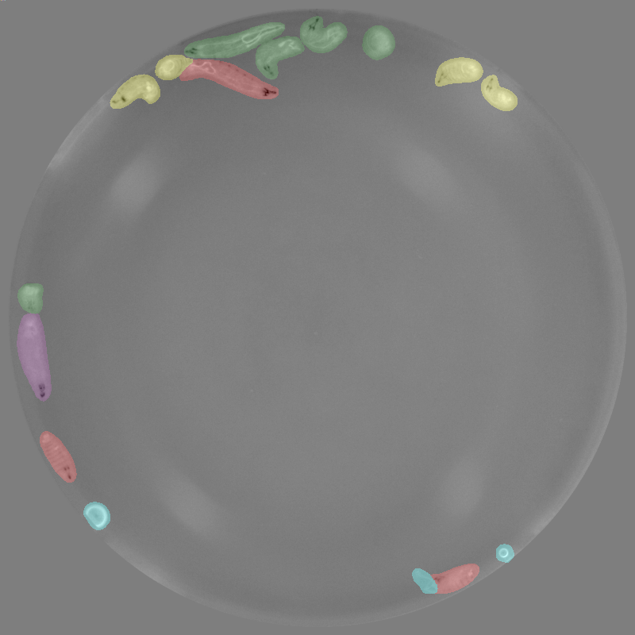

The purpose of this program is to analyze the images taken from the Biotek Cytation5 platereader. The program also has the ability to perform dose-response curve analysis and calculate LC values. 

## Use
For Windows 10, the recommended method is to use the included batch file to invoke the program. The PYTHON_HOME variable should be set to the computer's path to the python executable. 

Alternatively, one may invoke the program directly with `main.py`, which takes no command line arguments. 

All variables used by the program are set in either `./config.txt` or in `./stats/analysis_config.txt`; the former contains arguments for the GUI and general program options and filepaths, while the latter contains options related to data analysis, statistical options, and filepaths related to the statistical analysis output. The `./docs/stats_config` file describes the permitted variables and their actions for the statistical analysis and plotting options, while `./docs/general_config` describes the permitted options for the general program. 

## Requirements

This program requires the use of Python 3. The testing was performed with Python 3.8. The Anaconda distribution is recommended for ease; otherwise, `scikit-image`, `numpy`, `scipy`, `tensorflow`, `tkinter`, and other packages may be needed. 

The GUI does require the addition of `tkcalendar`, which is easily installed using pip. 

Testing has been performed on Ubuntu 20.04 and Windows 10 using Python 3.8.8.

Tensorflow is used for analyzing the images with the Mask R-CNN algorithm. The process is highly parallelized, and runs fastest with a CUDA-enabled NVIDIA graphics card; however, images can also be processed on multiple CPU cores. 

## Graphical User Interface

## Data Collection and Analysis Pipeline

The pipeline from image collection to data output is as follows:

1. The platereader takes three high-resolution, 2048x2048 pixel .tiff images of the well. Images are spaced approximately 0.2 seconds apart, and are saved locally. 
<figure>
  
   
  
  <figcaption aria-hidden="true">Example of the three images of a single well, taken fractions of a second apart. Note the movement of some larvae near the top of the image.</figcaption>
</figure>
2. For each well, these three images are used to make a composite image with six channels as follows:
	1. Red channel of the first image
	2. Green channel of the first image
	3. Blue channel of the first image
	4. Prewitt edge filter of guassian blurred grayscale version of the first image
	5. Grayscale of the second image
	6. Grayscale of the third image
3. The grayscale of the first image is also subjected to a Circle Hough Transform to determine the edge of the well. The area outside the well is set to mean value of the inside of the well for each image channel. The image is also cropped and centered on the center of the well, and downsized to 800x800 pixels and single precision. Setting the area outside the well to a uniform color removes any reflections of the larvae and ensures that objects are not detected in this area. 
4. The trained Mask R-CNN algorithm processes each image to classify larvae as dead, alive, moribund, L2 larvae, egg, long-dead, or artifact. 
5. The number of each class is counted, and, if the user has selected the option, composite images are made. Options for composite images include a stack of the three grayscale images for the well as the red, green, and blue channels; a grayscale of the first image with bounding boxes, or a grayscle of the first image with colored masks. In images with bounding boxes or masks shown, the following colors are used:
	- live: green 
	- dead: red 
	- moribund: yellow 
	- L2 larvae: purple
	- egg: blue 
	- long-dead: brown 
	- artifact: cyan 
<figure>
  
   
  
  <figcaption aria-hidden="true">The RGB composite, bounding box, and masked output images corresponding to the three raw images shown above. Note that the images are centered on the well, and the area outside the well is a uniform gray. Artifact bounding boxes are not shown in the bounding box image to prevent visual crowding in wells with significant debris. Note that this well contains objects identified as live, dead, morbund, and L2, as well as several small bubbles classified as artifacts. </figcaption>
</figure>
6. A .csv file containing the count data for each well is produced. Only the live, dead, and moribund larvae are counted; the moribund larvae are included with the dead larvae. The other four groups are not included in the count data; however, if there are more than five total objects not classified as live, dead, or moribund, a note is included in the .csv file stating the number of eggs, L2 larvae, long-dead larvae, and artifacts in the well. 

## Training Set

The Mask R-CNN algorithm was trained using a set of 800 hand-classified wells. This training set included 6032 live larvae, 942 moribund larvae, 2178 dead larvae, 164 eggs, 290 aged dead larvae, 173 L2 larve, and 328 artifacts. Labelling of images was performed using the [VGG Image Annotator (VIA) version 2](https://www.robots.ox.ac.uk/~vgg/software/via/).[^1] 

The data set was augmented to produce 48,000 training images and 8,000 validation images. Augmentation was performed using `misc/image_augment.py`, which applies random rotations, scaling, gamma adjustments, blurring, and flipping about the y-axis to generate new images and corresponding json images. The augmentation program also creates a new annotation `.json` file for all the transformed labels for the augmented images. Note that the `.json` annotation file must match that of the VIA output annotation to be properly adjusted during the augmentation process.

[^1]: Abhishek Dutta and Andrew Zisserman. **2019**. *The VIA Annotation Software for Images, Audio and Video*. In *Proceedings of the 27th ACM International Conference on Multimedia (MM ’19)*, October 21–25, 2019, Nice, France. ACM, New York, NY, USA, 4 pages. https://doi.org/10.1145/3343031.3350535.